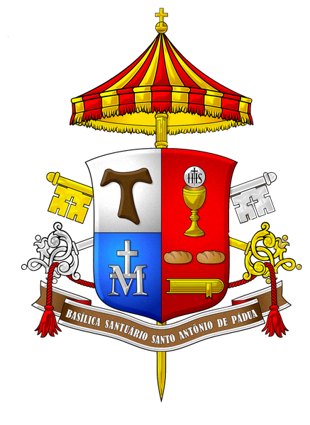

<h1 align="center">Arte pela Basílica · 2026</h1>

<p align="center">
  <strong>Uma coleção com propósito. Uma experiência para guardar.</strong><br />
  Catálogo digital, galeria 3D e pré-reservas para a exposição beneficente da Basílica Santo Antônio.
</p>

<p align="center">
  <a href="https://leonardorr.github.io/arte-pela-basilica-2026/"><strong>Visitar experiência</strong></a>
  ·
  <a href="https://leonardorr.github.io/arte-pela-basilica-2026/#acervo">Explorar acervo</a>
</p>

<p align="center">
  <a href="https://github.com/LeoNardoRR/arte-pela-basilica-2026/actions/workflows/pages.yml"></a>
  
  
  
  
</p>

---

## O projeto

**Arte pela Basílica 2026** transforma o catálogo oficial da exposição em uma experiência digital imersiva e responsiva. O visitante pode conhecer as **84 obras reais**, observar seus formatos e molduras, interagir com uma apresentação 3D e registrar uma pré-reserva para conclusão presencial.

O projeto existe para contribuir financeiramente com a **Basílica Santo Antônio de Pádua**, em Americana. Não há pagamento de obras pela internet: o site registra a intenção, bloqueia temporariamente a disponibilidade e orienta o visitante sobre a conclusão da compra.

## Experiência

| Para o visitante | Para a organização |
|---|---|
| Acervo editorial com as 84 imagens oficiais | Painel administrativo protegido pelo Supabase |
| Filtros de disponibilidade e valores em reais | Fila de atendimento agrupada por interessado |
| Zoom e experiência 3D por toque ou mouse | Controle de preços, inclusive com centavos |
| Seleção com valor total e oferta adicional | Alteração de status e liberação de obras |
| Pré-reserva com cronômetro e alertas | Histórico de intenções com rolagem interna |
| Layout mobile-first e navegação acessível | Dados persistentes e regras de acesso protegidas |
| Música clássica opcional com controle de som | Gestão preparada para o atendimento presencial |
| Área dedicada à futura doação via QR Code PIX | Visão consolidada de obras, pessoas e valores |

## Regras de pré-reserva

| Período | Bloqueio | Conclusão da compra |
|---|---:|---|
| **10 de setembro · dia do evento** | **30 minutos** | Hotel Florença |
| **11 a 17 de setembro** | **24 horas** | Basílica Santo Antônio de Pádua, em Americana |

A pré-reserva não gera cobrança online. O prazo é exibido em tempo real e a comunicação de confirmação repete o local e o limite aplicáveis à escolha do visitante.

## Destaques técnicos

- Interface em **React 19 + TypeScript**, com CSS autoral e identidade editorial.
- Visualização interativa em **Three.js**, com frente, espessura e verso das obras.
- Animações com **GSAP ScrollTrigger** e suporte a `prefers-reduced-motion`.
- Catálogo, autenticação e intenções persistidos no **Supabase**.
- Valores e disponibilidade tratados como dados confiáveis do servidor.
- Navegação por teclado, textos semânticos e estados de interface acessíveis.
- Build estático com **Vite** e publicação automática pelo **GitHub Actions**.
- Experiência responsiva validada para desktop, tablet e celular.

## Tecnologias

| Camada | Ferramentas |
|---|---|
| Interface | React 19, TypeScript, HTML semântico e CSS |
| Movimento e 3D | Three.js, GSAP e ScrollTrigger |
| Dados e autenticação | Supabase, PostgreSQL e políticas de acesso |
| QR Code | `qrcode` |
| Build | Vite e vinext |
| Qualidade | ESLint e testes com Node.js |
| Hospedagem | GitHub Pages e GitHub Actions |

## Executando localmente

**Requisito:** Node.js `>= 22.13.0`

```bash
git clone https://github.com/LeoNardoRR/arte-pela-basilica-2026.git
cd arte-pela-basilica-2026
npm install
npm run dev:pages
```

O endereço local será exibido no terminal, normalmente em `http://localhost:5173`.

### Comandos úteis

```bash
npm run dev:pages     # desenvolvimento com a configuração do Pages
npm run build:pages   # build estático de produção
npm run lint          # análise de qualidade do código
npm test              # build completo e testes automatizados
```

## Publicação

O workflow [`.github/workflows/pages.yml`](.github/workflows/pages.yml) é acionado a cada atualização do branch `main`:

1. instala as dependências com `npm ci`;
2. gera o pacote estático com `npm run build:pages`;
3. prepara o fallback de rotas;
4. publica o artefato no GitHub Pages.

**Produção:** [leonardorr.github.io/arte-pela-basilica-2026](https://leonardorr.github.io/arte-pela-basilica-2026/)

## Estrutura principal

```text
app/
├── Catalog.tsx                 # experiência pública e fluxo de pré-reserva
├── ArtworkExperience3D.tsx     # visualização tridimensional
├── DonationSection.tsx         # doação e futuro QR Code PIX
├── ReservationCountdown.tsx    # cronômetro e alertas de expiração
├── Admin.tsx                   # operação administrativa
└── globals.css                 # identidade visual e responsividade

public/
├── artworks-clean/             # recortes tratados das 84 obras
├── sponsors/                   # marcas dos parceiros
└── audio-air-bach.ogg          # ambientação sonora opcional

supabase/migrations/            # catálogo, preços, reservas e regras administrativas
tests/                          # verificações de fluxo, segurança e apresentação
```

## Parceiros desta edição

Hotel Florença · Contatto Transportes · Buquê de Flor · Quadrum · Juarez Godoy Arte e Cultura

## Conteúdo e créditos

As fotografias das obras e as marcas dos parceiros pertencem aos respectivos titulares e são utilizadas na apresentação oficial do evento. A ambientação sonora utiliza **Air**, de Bach, em gravação da U.S. Air Force Band disponibilizada em domínio público.

---

<p align="center">
  <br />
  <strong>Arte pela Basílica · Edição 2026</strong><br />
  Arte e participação comunitária em apoio à Basílica Santo Antônio.
</p>
